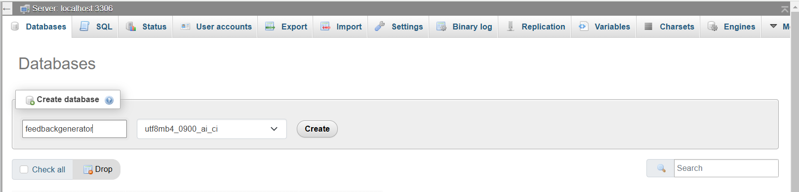

# FEEDBACK GENERATOR

A Django-based evaluation system that allows students to submit code assignments, evaluates them for syntax, indentation, and comments, and provides feedback.

## Features
- User authentication (Students, Tutors, Admins)
- Code submission and automated evaluation
- Admin-configurable evaluation criteria
- Feedback system with grading
- Django Admin Panel for user and evaluation management

## Installation & Setup

### Prerequisites
Ensure you have the following installed:
- Python 3.x
- pip
- virtualenv
- MySQL (or any other database configured in `settings.py`)

### Clone the Repository
```sh
$ git clone https://github.com/Chin3ll/feedback-pro.git
$ cd feedbackgenerator
```

### Create a Virtual Environment
```sh
$ python -m venv venv
$ source venv/Scripts/activate  # On Windows
```

```sh
$ python3 -m venv venv
$ source venv/bin/activate # On Mac
```

### Install Dependencies
```sh
$ pip install -r requirements.txt
```
### Configure Database
- Create a new DB in mysql called `feedbackgenerator` as seen here 
```sh 
$ pip install mysql-connector-python
```

1. Update DATABASES settings in settings.py:
    python
  ``` DATABASES = {
        "default": {
            "ENGINE": "mysql.connector.django",
            "NAME": "feedbackgenerator",
            "USER": "root",
            "PASSWORD": "",
            "HOST": "localhost",
            "PORT": "3306",
            "OPTIONS": {
                "autocommit": True,
            },
        }
    }
    ```


2. Run migrations:
    ```sh
    $ python manage.py makemigrations
    $ python manage.py migrate
    ```

### Create a Superuser
```sh
$ python manage.py createsuperuser
```
Follow the prompts to create an admin account.

### Run the Development Server
```sh
$ python manage.py runserver
```
The project will be available at `http://127.0.0.1:8000/`.

## Usage

### Starting the project
## step 1
- Navigate to `http://127.0.0.1:8000/login/`
- to login 

## step 2
- Navigate to `http://127.0.0.1:8000/login/`
- Login with your super user account 

## step 3 Assigning Roles
- Navigate to `http://127.0.0.1:8000/profile/`
Once on the profile page click on Admin Panel button to enable view the admin panel
- Admin Panel button 
Next click on the profile model to assign Admin role to your newly created account.  Note every newly created will require to be assign a role even a super user will have to assign himself the role of admin when he gets here
- Asign role to created user 
Next click on any desired user from the list. Note every newly created will require to be assign a role even a super user will have to assign himself the role of admin when he gets here
- User profile list 
Now assign a role to that user options includes (Student, Lecturer, Admin)
- User profile role 

## step Creating new user (Student)
- Navigate to `http://127.0.0.1:8000/admin/`
Once on the admin page click on users model 
- Now you'll be taken to this page `http://127.0.0.1:8000/auth/user/`
Next click on add user + at the top right corner of your screen 
- Now feel in the user details you want to create and click save  
Next Once the user has been created you have to go back to the profile model again to assign a role to that new user you just created
- User profile list 
Now assign a role to that user options includes (Student, Lecturer, Admin)
- User profile role 

## step Creating new user (Lecturer)
- Navigate to `http://127.0.0.1:8000/admin/`
Once on the admin page click on users model 
- Now you'll be taken to this page `http://127.0.0.1:8000/auth/user/`
Next click on add user + at the top right corner of your screen 
- Now feel in the user details you want to create and click save  
Make for to check mark all three permissions Active, Staff status and Superuser status
Next Once the user has been created you have to go back to the profile model again to assign a role to that new user you just created
- User profile list 
Now assign a role to that user options includes (Student, Lecturer, Admin)
- User profile role 

### Accessing the Admin Panel
- Navigate to `http://127.0.0.1:8000/admin/`
- Login with the superuser credentials

### Accessing the Admin dashboard
- Navigate to `http://127.0.0.1:8000/dashboard-a/`
- Login with the superuser credentials

### Accessing the Student dashboard
- Login as a student account
- Navigate to `http://127.0.0.1:8000/dashboard-s/`
- View student dashboard

### Reviewing Submissions (Lecturer View)
-Login as Lecturer account
- Navigate to `http://127.0.0.1:8000/dashboard-t/`
- View Tutor dashboard

## Deployment (Optional)
To deploy on a live server:
- Use **Gunicorn** and **Nginx** for production
- Configure **ALLOWED_HOSTS** in `settings.py`
- Set up a production database

## License
This project is open-source. You can modify and distribute it as needed.

## Contact
For any issues, reach out at `ochinell@outlook.com`.
